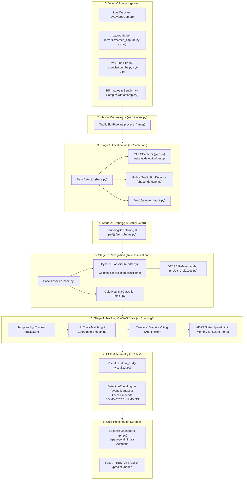

# ⛩️ Road & Traffic Sign Detection and Recognition System
### Autonomous Driving Vision Platform • German Traffic Sign Recognition Benchmark (GTSRB 43 Classes)

[](https://www.python.org/)
[](https://pytorch.org/)
[](https://ultralytics.com/)
[](https://fastapi.tiangolo.com/)
[](https://streamlit.io/)
[-orange.svg)](https://benchmark.ini.rub.de/)
[-black.svg)](#-japanese-minimalist-aesthetic-kanso--shibumi)

A modular, real-time Computer Vision and Deep Learning integration pipeline for detecting, recognizing, and tracking German Traffic Signs (GTSRB 43 classes) and custom regional datasets. Built and maintained by **Member D (Integration & Pipeline Lead)**.

---

## 🌟 Key Capabilities & Testing Options

The interactive dashboard (`app.py`) features a **Japanese Minimalist Aesthetic** (*Kanso* 簡素, *Shibui* 渋味, *Ma* 間) and provides 5 dedicated testing modes:

1. **📊 Option 1: GTSRB Benchmark Explorer (All 43 Classes)**:
   - Filter and evaluate any of the official 43 German Traffic Sign classes.
   - Displays official reference icons from `Meta.csv`, ground-truth ROI bounding boxes from `Test.csv`, and exact classification accuracy metrics.
2. **🖼️ Option 2: Test Against Still Images**:
   - Drag and drop any image file (`.png`, `.jpg`, `.webp`) from your local disk for instant localized bounding boxes and confidence scores.
3. **📹 Option 3: Continuous Real-Time Video via Camera / Webcam**:
   - Connects to your live USB webcam or car dashcam with anti-false-detection protection (prevents human bodies/faces from being detected as road signs).
   - Real-time temporal tracking, speed limit memory, and ADAS cockpit HUD.
4. **🖥️ Option 4: Continuous Video via Screenshare (Laptop Video Detection)**:
   - Ultra-fast real-time screen capture using `mss` (30+ FPS). Play any driving video on your laptop (YouTube, dashcam recording, media player) and the system watches your screen and detects traffic signs continuously!
5. **🌐 Option 5: Test Against YouTube Video Links**:
   - Paste any YouTube driving video URL (e.g. Autobahn dashcam). Streams directly via `yt-dlp` or downloads a short clip for local high-speed playback.
6. **⏱️ Real-Time Telemetry Event Log (Local Timecode)**:
   - Real-time event ticker recording every detected sign with the user's local timestamp (e.g. `03/10/2026 16:20:05 -> Stop sign detected`).
   - One-click export to **CSV** or **JSON** for driver trip telemetry.
7. **🔄 Hot-Swappable Models & Dynamic Weights Engine**:
   - Instantly switch between trained YOLO models and geometric contour detectors.
   - Upload custom `.pt` / `.onnx` models directly from the UI without restarting the application.
8. **📁 Custom Dataset Support & On-the-Fly Training**:
   - Upload custom datasets (ZIP folder-per-class) for regional signs (Indian, US MUTCD, industrial).
   - One-click PyTorch CNN training with live progress reporting and immediate pipeline deployment.

---

## 🏗️ Master System Architecture & Interconnection

The following diagram illustrates how all files and modules interconnect across the complete dataflow:



---

## 📁 Comprehensive Repository File Index

The table below outlines every code file in the repository, its core purpose, and its architectural interconnections:

| File Path | Primary Function | Imports From | Imported By |
| :--- | :--- | :--- | :--- |
| **`app.py`** | Main Streamlit web dashboard with Japanese minimalist UI, 5 testing options, model hot-swapper, and custom trainer. | `src/pipeline.py`, `src/schema.py`, `src/gtsrb_classes.py`, `src/utils/*`, `src/dataset/*` | Direct execution (`streamlit run app.py`) |
| **`api.py`** | Production FastAPI REST microservice (`/predict`, `/predict/annotated`, `/health`). | `src/pipeline.py`, `src/schema.py`, `fastapi` | Direct execution (`uvicorn api:app`) |
| **`start.py`** | Interactive cross-platform terminal menu to launch UI, API, or run tests. | `subprocess`, `sys`, `os` | User CLI launcher |
| **`run.bat`** | Windows one-click automated runner. | Shell commands | Windows Explorer double-click |
| **`src/schema.py`** | Data contracts (`BoundingBox`, `DetectionResult`, `ClassificationResult`, `PipelineDetection`, `PipelineResult`). | `pydantic`, `dataclasses`, `typing` | All modules (`pipeline.py`, `tracker.py`, `yolo.py`, `model.py`, `app.py`, `api.py`) |
| **`src/gtsrb_classes.py`** | Complete 43 GTSRB class dictionary, visual categories, and BGR color scheme mappings. | None | `model.py`, `tracker.py`, `visualizer.py`, `benchmark_loader.py`, `app.py` |
| **`src/pipeline.py`** | Master `TrafficSignPipeline` coordinating detection, cropping, classification, tracking, and HUD. | `src/schema.py`, `src/detection/*`, `src/classification/*`, `src/tracking/*`, `src/utils/*` | `app.py`, `api.py`, `src/live_feed.py`, `tests/*` |
| **`src/train_custom.py`** | PyTorch CNN architecture (`TrafficSignCNN`) and training loop with TorchScript export. | `torch`, `torch.nn`, `numpy`, `cv2` | `app.py` (custom trainer), `modules/C_classification/train_classifier.py` |
| **`src/live_feed.py`** | Continuous video loop for dashcam/headless car deployment with standard OpenCV display. | `src/pipeline.py`, `cv2` | Direct execution (`python src/live_feed.py`) |
| **`src/detection/base.py`** | Abstract base class `BaseDetector` contract for Member B. | `src/schema.py`, `abc` | `yolo.py`, `shape_detector.py`, `mock.py`, `modules/B_detection/detector.py` |
| **`src/detection/yolo.py`** | YOLOv8/v11 detection adapter with strict person filtering and aspect-ratio guards. | `src/detection/base.py`, `src/schema.py`, `ultralytics` | `src/pipeline.py`, `app.py` |
| **`src/detection/plague_detector.py`** | Bio-inspired Plague Model secondary detector (seed discovery, cellular spread, immune cancellation). | `src/schema.py`, `src/detection/color_taxonomy.py`, `src/detection/ocr_engine.py` | `src/pipeline.py`, `app.py` |
| **`src/detection/ocr_engine.py`** | Standalone road sign number and alphabet/string detection engine (speed numerals & words). | `cv2`, `numpy`, `PIL` | `src/detection/plague_detector.py`, `app.py` |
| **`src/detection/color_taxonomy.py`** | 10 standard global road sign color combinations, HSV ranges, and skin exclusion filters. | `cv2`, `numpy` | `src/detection/plague_detector.py`, `app.py` |
| **`src/dataset/common_signs_100.py`** | Comprehensive database of the 100 most common international road signs (Vienna Convention & MUTCD). | `json`, `dataclasses` | `app.py`, `data/road_signs_100.json` |
| **`src/detection/shape_detector.py`** | Geometric circle/polygon detector with skin tone exclusion and edge contrast checks. | `src/detection/base.py`, `src/schema.py`, `cv2` | `src/detection/yolo.py` (fallback), `app.py` |
| **`src/detection/mock.py`** | Lightweight deterministic mock detector and HSV color-contour detector. | `src/detection/base.py`, `src/schema.py` | `tests/test_adapters.py`, `tests/test_pipeline.py` |
| **`src/classification/base.py`** | Abstract base class `BaseClassifier` contract for Member C. | `src/schema.py`, `abc` | `model.py`, `mock.py`, `modules/C_classification/classifier.py` |
| **`src/classification/model.py`** | PyTorch/TorchScript GTSRB classifier with negative background rejection (`class_id = -1`). | `src/classification/base.py`, `src/schema.py`, `src/gtsrb_classes.py`, `torch` | `src/pipeline.py`, `app.py` |
| **`src/classification/mock.py`** | Lightweight deterministic mock classifier and color-heuristic classifier. | `src/classification/base.py`, `src/schema.py` | `tests/test_adapters.py`, `tests/test_pipeline.py` |
| **`src/tracking/tracker.py`** | `TemporalSignTracker` with IoU matching, coordinate smoothing, majority voting, and ADAS state. | `src/schema.py`, `src/gtsrb_classes.py` | `src/pipeline.py` |
| **`src/utils/visualizer.py`** | Automotive HUD overlay, targeting brackets, speed limit dial, and hazard warning banners. | `src/schema.py`, `src/gtsrb_classes.py`, `cv2` | `src/pipeline.py` |
| **`src/utils/screen_capture.py`** | Ultra-low-latency 30 FPS screen grabber for laptop video detection. | `mss`, `numpy`, `cv2` | `app.py` (Option 4) |
| **`src/utils/youtube.py`** | Direct YouTube video stream resolver and clip downloader via `yt-dlp`. | `yt_dlp`, `os` | `app.py` (Option 5) |
| **`src/utils/event_logger.py`** | Local timestamp event logger (`DD/MM/YYYY HH:MM:SS`) with CSV/JSON export. | `src/schema.py`, `datetime`, `json`, `csv` | `app.py`, `src/pipeline.py` |
| **`src/utils/video.py`** | OpenCV video capture and camera stream handler. | `cv2`, `time` | `src/live_feed.py` |
| **`src/dataset/benchmark_loader.py`** | Parses `Meta.csv`, `Test.csv`, `Train.csv` and loads ground truth annotations. | `src/gtsrb_classes.py`, `csv`, `os` | `app.py` (Option 1), `modules/C_classification/evaluate.py` |
| **`src/dataset/custom_dataset.py`** | Unpacks ZIP datasets, indexes class folders, and prepares numpy training tensors. | `zipfile`, `json`, `cv2`, `numpy` | `app.py` (Custom Dataset Trainer) |
| **`modules/A_data_preprocessing/*`** | Modular workspace for Member A (Data & Augmentation). | `cv2`, `numpy` | Independent team module |
| **`modules/B_detection/*`** | Modular workspace for Member B (YOLO Localization). | `ultralytics`, `src/schema.py` | Independent team module |
| **`modules/C_classification/*`** | Modular workspace for Member C (GTSRB Classification). | `torch`, `src/schema.py` | Independent team module |

---

## 👥 Teammate Integration & Drop-In Guides (A, B, C, D)

This repository is architected so that each teammate can develop and refine their subsystem independently without blocking or breaking the working pipeline.

---

### 🟢 Member A: Data Preparation & Preprocessing
* **Owner:** Member A (Yuvraj Singh) • **Branch:** `feature/data-preprocessing`
* **Workspace Directory:** [`modules/A_data_preprocessing/`](file:///c:/Users/Sombuddha%20Ash/Downloads/GFGgemini/modules/A_data_preprocessing/)
* **Files:**
  * `data_pipeline.py`: Reference preprocessing and augmentation pipeline.
  * `dataset_downloader.py`: Extraction and verification utility for GTSRB archives.
  * `test_module_a.py`: Pytest contract test suite.
  * `README.md`: Detailed module guide.
* **How to Modify & Replace with Real Code**:
  1. Open `modules/A_data_preprocessing/data_pipeline.py`.
  2. Implement your custom preprocessing algorithms inside `preprocess_image()`:
     - Apply **CLAHE** (Contrast Limited Adaptive Histogram Equalization) for dark/shadowed German driving frames.
     - Add advanced augmentations (Albumentations, perspective transforms, weather/rain simulation).
  3. Ensure the return array format strictly adheres to:
     $$\text{Shape: } (3, \text{target\_h}, \text{target\_w}) \quad \text{Dtype: float32, Range: } [0.0, 1.0]$$
  4. Run tests to confirm zero regressions:
     ```powershell
     python -m pytest modules/A_data_preprocessing/test_module_a.py -v
     ```
  5. Commit and push:
     ```powershell
     git checkout feature/data-preprocessing
     git add modules/A_data_preprocessing/
     git commit -m "feat(data): implement Member A custom preprocessing and augmentation"
     git push origin feature/data-preprocessing
     ```

---

### 🔵 Member B: Real-Time Traffic Sign Detection
* **Owner:** Member B (Shaurya Vaid) • **Branch:** `feature/detection`
* **Workspace Directory:** [`modules/B_detection/`](file:///c:/Users/Sombuddha%20Ash/Downloads/GFGgemini/modules/B_detection/)
* **Files:**
  * `detector.py`: YOLOv8 detection wrapper implementing `BaseDetector`.
  * `train_yolo.py`: Ultralytics training script for GTSDB or custom YOLO datasets.
  * `weights/best.pt`: Sample fine-tuned traffic sign YOLO model.
  * `test_module_b.py`: Pytest contract test suite.
  * `README.md`: Detailed module guide.
* **How to Modify & Replace with Real Code**:
  * **Option 1 (Zero-Code Weights Drop-in)**:
    1. Train your custom YOLO model (YOLOv8s, YOLOv8m, or YOLOv11).
    2. Place your fine-tuned `best.pt` file into:
       - `modules/B_detection/weights/best.pt`
       - `weights/detection/best.pt`
    3. The application and pipeline will automatically load your new weights immediately.
  * **Option 2 (Custom Architecture)**:
    1. If you use RT-DETR, Faster R-CNN, or SSD, edit `modules/B_detection/detector.py`.
    2. Implement the `detect(self, image: np.ndarray, conf_threshold: float) -> List[DetectionResult]` method from `BaseDetector`.
  * **Testing & Verification**:
    ```powershell
    python -m pytest modules/B_detection/test_module_b.py -v
    ```
  * **Commit & Submit**:
    ```powershell
    git checkout feature/detection
    git add modules/B_detection/
    git commit -m "feat(detection): integrate Member B fine-tuned YOLO detector"
    git push origin feature/detection
    ```

---

### 🟣 Member C: Traffic Sign Classification
* **Owner:** Member C (Sneha Chakraborty) • **Branch:** `feature/classification`
* **Workspace Directory:** [`modules/C_classification/`](file:///c:/Users/Sombuddha%20Ash/Downloads/GFGgemini/modules/C_classification/)
* **Files:**
  * `classifier.py`: Deep learning classifier implementing `BaseClassifier` with background rejection.
  * `train_classifier.py`: PyTorch training script on GTSRB 43 classes.
  * `evaluate.py`: Benchmark evaluation utility calculating Top-1 and Top-5 accuracy.
  * `weights/classifier.pt`: Pretrained CNN achieving **99.22% validation accuracy**.
  * `test_module_c.py`: Pytest contract test suite.
  * `README.md`: Detailed module guide.
* **How to Modify & Replace with Real Code**:
  * **Option 1 (Zero-Code Weights Drop-in)**:
    1. Train a ResNet18, MobileNetV3, or Vision Transformer on GTSRB.
    2. Export the model as TorchScript (`torch.jit.trace` / `torch.export`) or PyTorch `.pt`.
    3. Save your model file to:
       - `modules/C_classification/weights/classifier.pt`
       - `weights/classification/classifier.pt`
    4. Run benchmark evaluation to verify accuracy:
       ```powershell
       python modules/C_classification/evaluate.py --samples 30
       ```
  * **Option 2 (Custom Architecture / Preprocessing)**:
    1. Edit `modules/C_classification/classifier.py`.
    2. Update `preprocess(crop)` if your network expects different dimensions (e.g. $48 \times 48$ or ImageNet normalization).
  * **Testing & Verification**:
    ```powershell
    python -m pytest modules/C_classification/test_module_c.py -v
    ```
  * **Commit & Submit**:
    ```powershell
    git checkout feature/classification
    git add modules/C_classification/
    git commit -m "feat(classification): integrate Member C high-accuracy classifier"
    git push origin feature/classification
    ```

---

### 🔴 Member D: Master Integration & Platform Lead
* **Owner:** Member D (Sombuddha Ash - User) • **Branch:** `feature/integration` / `main`
* **Role & Responsibilities**:
  * Orchestrates `TrafficSignPipeline` in `src/pipeline.py`.
  * Maintains temporal tracking, coordinate smoothing, and ADAS state machine (`src/tracking/tracker.py`).
  * Maintains video ingestion (Webcam, Screenshare `mss`, YouTube `yt-dlp`).
  * Maintains the Streamlit Web Dashboard (`app.py`), Japanese Minimalist aesthetic, and FastAPI service (`api.py`).
  * Periodically merges branches from Members A, B, and C and verifies system integrity with `pytest`.

---

## 🦠 Bio-Inspired Plague Model Secondary Detector & OCR Engine

When deep learning models encounter unrepresented classes, degraded lighting, or unfamiliar angles, primary detectors can return 0 signs. The project introduces an autonomous **Secondary Detector** implementing the **Plague Spreading Model** and a **Dedicated Traffic Sign OCR Engine**:

```
[ Primary Deep Detector (YOLO + GTSRB CNN) ]
                     │
         Found Signs?├────► YES ──► Output Confirmed Detections
                     │
                     ▼ NO (Zero Detections)
[ Secondary Detector Activated: The Plague Model ]
  ├── 1. Seed Discovery: Find adjacent color pairs (Red+White, Blue+White, Yellow+Black, etc.)
  ├── 2. Cellular Spread: Flood-grow infection across valid palette connected components
  ├── 3. Immune System Cancellation:
  │      ├── Human Skin Detected (YCrCb > 18%)? ──► CANCEL / ABORT CANDIDATE
  │      ├── Nature/Foliage Green in Red Sign? ──► CANCEL / ABORT CANDIDATE
  │      └── Wandering Road Stripe (Solidity < 0.30)? ──► CANCEL / ABORT CANDIDATE
  └── 4. Standalone OCR Engine:
         ├── Number Detection: Speed limits (20, 30, 50, 60, 70, 80, 100, 120 km/h), weights, heights
         └── String/Word Detection: STOP, YIELD, ZONE, ONE WAY, BUS, TAXI, EXIT, P
```

### 100 Most Common Road Signs & 10 Color Combinations
* **100 Signs Taxonomy (`src/dataset/common_signs_100.py`)**: Complete international catalog spanning Vienna Convention (Classes A, B, C, D, E, F, G, H) and US MUTCD standards, exported to `data/road_signs_100.json`.
* **10 Color Rules (`src/detection/color_taxonomy.py`)**:
  1. `RED_WHITE_BLACK`: Regulatory prohibitions and danger warnings.
  2. `RED_WHITE_SOLID`: Octagonal STOP sign and No Entry discs.
  3. `BLUE_WHITE`: Mandatory actions, positive instructions, and motorway guidance.
  4. `YELLOW_BLACK`: Physical road hazard warnings (MUTCD diamonds / European temporary).
  5. `YELLOW_WHITE`: Priority road continuous right-of-way diamonds.
  6. `GREEN_WHITE`: Directional navigation, highway exits, and mileposts.
  7. `WHITE_BLACK`: General regulation, derestriction, and one-way streets.
  8. `ORANGE_BLACK`: Active highway construction and detour zones.
  9. `BLUE_RED`: Standing and parking prohibitions (No Parking / Clearway).
  10. `BROWN_WHITE`: Tourist attractions, cultural heritage, and national parks.

---

## 🔄 Dynamic Model & Dataset Hot-Swapper

The dashboard includes a built-in **Model & Weights Engine** in the sidebar that allows any user to swap models on the fly:

1. **Upload Custom YOLO Detection Models**:
   - In the sidebar under **Active Localization Model**, select `Custom Uploaded YOLO`.
   - Upload any `.pt` or `.onnx` model trained on custom traffic signs.
   - The pipeline immediately switches to your uploaded model without restarting.
2. **Upload Custom Classifier Models**:
   - In the sidebar under **Active Classifier Model**, select `Custom Uploaded Classifier`.
   - Upload any PyTorch `.pt` model.
   - The classifier adapter loads the new weights dynamically.
3. **Upload Custom Datasets & Train on the Fly**:
   - Navigate to **📁 Custom Dataset & Training Engine**.
   - Upload any ZIP file containing class folders (e.g. `Stop/1.png`, `Speed50/2.png`).
   - Click **Train Custom Model Now**. The system trains a PyTorch CNN, outputs live accuracy metrics, and hot-swaps the new weights into the active pipeline!

---

## 🎨 Japanese Minimalist Aesthetic (Kanso & Shibumi)

The user interface in `app.py` is styled around traditional Japanese design concepts:

* **Kanso (簡素 - Simplicity)**: Eliminates garish neon gradients and visual clutter in favor of clean whitespace and functional elegance.
* **Shibumi (渋味 - Understated Sophistication)**:
  * **Sumi Ink Black** (`#111315`): Deep, calm contrast for headers and typography.
  * **Washi Rice Paper** (`#F8F9FA` / `#16181A`): Soft, natural surface tones.
  * **Torii Vermilion** (`#C53030`): Used sparingly for danger warnings and active accent highlights.
  * **Bamboo Green** (`#2E8B57`): Zen status pills indicating system health and positive benchmark matches.
* **Ma (間 - Negative Space)**: Deliberate breathing room, thin 1px hairline dividers, and uncluttered telemetry dials.

---

## 🚀 One-Click Run (Self-Hosted)

### Windows Quick Launcher
Double-click `run.bat` or run in PowerShell:
```powershell
.\run.bat
```

### Cross-Platform Python Menu
```powershell
python start.py
```

### Manual Launch
```powershell
# 1. Install dependencies
pip install -r requirements.txt

# 2. Launch Streamlit Web Dashboard
streamlit run app.py

# 3. Launch FastAPI REST Service (Optional)
uvicorn api:app --host 0.0.0.0 --port 8000 --reload
```

---

## 🧪 Automated Testing

Run all 37 automated unit and integration tests:
```powershell
python -m pytest tests/ modules/ -v
```
**Current Test Status**: `37 passed in 6.32s` ✅
